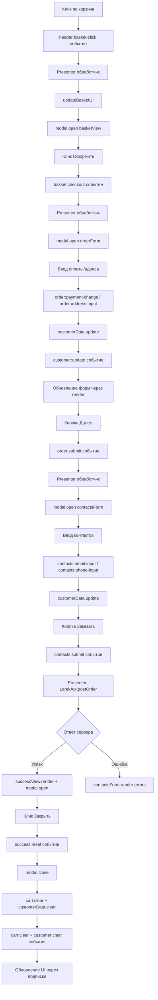

# Проектная работа "Веб-ларек"

Стек: HTML, SCSS, TS, Vite

Структура проекта:

- src/ — исходные файлы проекта
- src/components/ — папка с JS компонентами
- src/components/base/ — папка с базовым кодом

Важные файлы:

- index.html — HTML-файл главной страницы
- src/types/index.ts — файл с типами
- src/main.ts — точка входа приложения
- src/scss/styles.scss — корневой файл стилей
- src/utils/constants.ts — файл с константами
- src/utils/utils.ts — файл с утилитами

## Установка и запуск

Для установки и запуска проекта необходимо выполнить команды

```
npm install
npm run dev
```

или

```
yarn
yarn dev
```

## Сборка

```
npm run build
```

или

```
yarn build
```

# Интернет-магазин «Web-Larёk»

«Web-Larёk» — это интернет-магазин с товарами для веб-разработчиков, где пользователи могут просматривать товары, добавлять их в корзину и оформлять заказы. Сайт предоставляет удобный интерфейс с модальными окнами для просмотра деталей товаров, управления корзиной и выбора способа оплаты, обеспечивая полный цикл покупки с отправкой заказов на сервер.

## Архитектура приложения

Код приложения разделен на слои согласно парадигме MVP (Model-View-Presenter), которая обеспечивает четкое разделение ответственности между классами слоев Model и View. Каждый слой несет свой смысл и ответственность:

Model - слой данных, отвечает за хранение и изменение данных.  
View - слой представления, отвечает за отображение данных на странице.  
Presenter - презентер содержит основную логику приложения и отвечает за связь представления и данных.

Взаимодействие между классами обеспечивается использованием событийно-ориентированного подхода. Модели и Представления генерируют события при изменении данных или взаимодействии пользователя с приложением, а Презентер обрабатывает эти события используя методы как Моделей, так и Представлений.

### Базовый код

#### Класс Component

Является базовым классом для всех компонентов интерфейса.
Класс является дженериком и принимает в переменной `T` тип данных, которые могут быть переданы в метод `render` для отображения.

Конструктор:  
`constructor(container: HTMLElement)` - принимает ссылку на DOM элемент за отображение, которого он отвечает.

Поля класса:  
`container: HTMLElement` - поле для хранения корневого DOM элемента компонента.

Методы класса:  
`render(data?: Partial<T>): HTMLElement` - Главный метод класса. Он принимает данные, которые необходимо отобразить в интерфейсе, записывает эти данные в поля класса и возвращает ссылку на DOM-элемент. Предполагается, что в классах, которые будут наследоваться от `Component` будут реализованы сеттеры для полей с данными, которые будут вызываться в момент вызова `render` и записывать данные в необходимые DOM элементы.  
`setImage(element: HTMLImageElement, src: string, alt?: string): void` - утилитарный метод для модификации DOM-элементов ``

#### Класс Api

Содержит в себе базовую логику отправки запросов.

Конструктор:  
`constructor(baseUrl: string, options: RequestInit = {})` - В конструктор передается базовый адрес сервера и опциональный объект с заголовками запросов.

Поля класса:  
`baseUrl: string` - базовый адрес сервера  
`options: RequestInit` - объект с заголовками, которые будут использованы для запросов.

Методы:  
`get(uri: string): Promise<object>` - выполняет GET запрос на переданный в параметрах ендпоинт и возвращает промис с объектом, которым ответил сервер  
`post(uri: string, data: object, method: ApiPostMethods = 'POST'): Promise<object>` - принимает объект с данными, которые будут переданы в JSON в теле запроса, и отправляет эти данные на ендпоинт переданный как параметр при вызове метода. По умолчанию выполняется `POST` запрос, но метод запроса может быть переопределен заданием третьего параметра при вызове.  
`handleResponse(response: Response): Promise<object>` - защищенный метод проверяющий ответ сервера на корректность и возвращающий объект с данными полученный от сервера или отклоненный промис, в случае некорректных данных.

#### Класс EventEmitter

Брокер событий реализует паттерн "Наблюдатель", позволяющий отправлять события и подписываться на события, происходящие в системе. Класс используется для связи слоя данных и представления.

Конструктор класса не принимает параметров.

Поля класса:  
`_events: Map<string | RegExp, Set<Function>>)` - хранит коллекцию подписок на события. Ключи коллекции - названия событий или регулярное выражение, значения - коллекция функций обработчиков, которые будут вызваны при срабатывании события.

Методы класса:  
`on<T extends object>(event: EventName, callback: (data: T) => void): void` - подписка на событие, принимает название события и функцию обработчик.  
`emit<T extends object>(event: string, data?: T): void` - инициализация события. При вызове события в метод передается название события и объект с данными, который будет использован как аргумент для вызова обработчика.  
`trigger<T extends object>(event: string, context?: Partial<T>): (data: T) => void` - возвращает функцию, при вызове которой инициализируется требуемое в параметрах событие с передачей в него данных из второго параметра.

#### Типы данных

Все типы объявлены в файле `src/types/index.ts`.

**`ApiPostMethods`** — тип HTTP-методов для POST-запросов. Допустимые значения: `"POST"`, `"PUT"`, `"DELETE"`.

**`IApi`** — интерфейс для отправки HTTP-запросов. Используется для инверсии зависимостей в `LarekApi`. Методы:

| Метод     | Параметры                                                | Возвращает   | Описание                                |
| :-------- | :------------------------------------------------------- | :----------- | :-------------------------------------- |
| `get<T>`  | `uri: string`                                            | `Promise<T>` | GET-запрос к указанному эндпоинту       |
| `post<T>` | `uri: string`, `data: object`, `method?: ApiPostMethods` | `Promise<T>` | POST/PUT/DELETE-запрос с данными в теле |

**`Product`** — сущность товара в каталоге.

| Поле          | Тип        | Описание                                        |
| :------------ | :--------- | :---------------------------------------------- | --------------------------------------- |
| `id`          | `string`   | Уникальный идентификатор товара                 |
| `title`       | `string`   | Название товара                                 |
| `image`       | `string`   | Путь к изображению товара                       |
| `category`    | `string`   | Категория товара (для отображения и стилизации) |
| `price`       | `number \\ | null`                                           | Цена товара. `null` означает "бесценно" |
| `description` | `string`   | Описание товара                                 |

**`Customer`** — сущность данных покупателя (контактная информация и способ оплаты).

| Поле      | Тип        | Описание          |
| :-------- | :--------- | :---------------- | --- | ---------------------------------------------- |
| `payment` | `"card" \\ | "cash" \\         | ""` | Способ оплаты: картой, наличными или не выбран |
| `address` | `string`   | Адрес доставки    |
| `email`   | `string`   | Email для связи   |
| `phone`   | `string`   | Телефон для связи |

**`CustomerErrors`** — тип для хранения ошибок валидации полей покупателя. Ключи совпадают с полями `Customer`, значения — сообщения об ошибках или отсутствуют.

**`CustomerValidationResult`** — результат валидации данных покупателя.

| Поле      | Тип              | Описание                              |
| :-------- | :--------------- | :------------------------------------ |
| `isValid` | `boolean`        | `true`, если все поля валидны         |
| `errors`  | `CustomerErrors` | Объект с сообщениями об ошибках полей |

**`ProductListResponse`** — ответ сервера со списком товаров.

| Поле    | Тип         | Описание                 |
| :------ | :---------- | :----------------------- |
| `total` | `number`    | Общее количество товаров |
| `items` | `Product[]` | Массив товаров           |

**`Order`** — данные заказа для отправки на сервер. Расширяет `Customer` дополнительными полями.

| Поле                        | Тип        | Описание                               |
| :-------------------------- | :--------- | :------------------------------------- |
| _(наследует от `Customer`)_ |            | `payment`, `address`, `email`, `phone` |
| `total`                     | `number`   | Общая сумма заказа                     |
| `items`                     | `string[]` | Массив ID товаров в корзине            |

**`OrderResult`** — результат создания заказа на сервере.

| Поле    | Тип      | Описание                                   |
| :------ | :------- | :----------------------------------------- |
| `id`    | `string` | Уникальный идентификатор созданного заказа |
| `total` | `number` | Итоговая сумма заказа                      |

#### Модели данных

Все модели наследуются от `EventEmitter` и генерируют события при изменении данных.

##### Catalog

Класс для хранения и управления каталогом товаров. Генерирует события `catalog:update` при обновлении списка товаров и `catalog:selected-change` при выборе товара.

| Поле              | Тип         | Описание                     |
| :---------------- | :---------- | :--------------------------- | ------------------------------------------------ |
| `products`        | `Product[]` | Массив всех товаров каталога |
| `selectedProduct` | `Product \\ | null`                        | Текущий выбранный товар для детального просмотра |

| Метод                | Параметры             | Возвращает  | Описание                                 |
| :------------------- | :-------------------- | :---------- | :--------------------------------------- | ------------------------------------------------------------- |
| `setProducts`        | `products: Product[]` | `void`      | Сохраняет массив товаров, создавая копию |
| `getProducts`        | -                     | `Product[]` | Возвращает копию массива всех товаров    |
| `getProductById`     | `id: string`          | `Product \\ | undefined`                               | Возвращает товар с указанным ID или `undefined`               |
| `setSelectedProduct` | `product: Product \\  | null`       | `void`                                   | Сохраняет товар для детального просмотра или сбрасывает выбор |
| `getSelectedProduct` | -                     | `Product \\ | null`                                    | Возвращает текущий выбранный товар или `null`                 |

##### Cart

Класс для хранения и управления корзиной покупок. Генерирует события `cart:add`, `cart:remove`, `cart:clear` при изменении содержимого.

| Поле    | Тип         | Описание                              |
| :------ | :---------- | :------------------------------------ |
| `items` | `Product[]` | Массив товаров, добавленных в корзину |

| Метод           | Параметры          | Возвращает  | Описание                                                               |
| :-------------- | :----------------- | :---------- | :--------------------------------------------------------------------- |
| `getItems`      | -                  | `Product[]` | Возвращает копию массива товаров в корзине                             |
| `addItem`       | `product: Product` | `void`      | Добавляет товар в корзину                                              |
| `removeItem`    | `product: Product` | `void`      | Удаляет товар из корзины по совпадению ID                              |
| `clear`         | -                  | `void`      | Очищает корзину                                                        |
| `getTotalPrice` | -                  | `number`    | Возвращает суммарную стоимость (товары с `null` ценой считаются как 0) |
| `getItemCount`  | -                  | `number`    | Возвращает количество товаров в корзине                                |
| `hasItem`       | `id: string`       | `boolean`   | Проверяет наличие товара с указанным ID                                |

##### CustomerData

Класс для хранения и валидации данных покупателя. Генерирует события `customer:update` при изменении данных и `customer:clear` при очистке.

| Поле   | Тип        | Описание                                                           |
| :----- | :--------- | :----------------------------------------------------------------- |
| `data` | `Customer` | Объект с данными покупателя (способ оплаты, адрес, email, телефон) |

| Метод      | Параметры                   | Возвращает                 | Описание                                              |
| :--------- | :-------------------------- | :------------------------- | :---------------------------------------------------- |
| `update`   | `fields: Partial<Customer>` | `void`                     | Обновляет переданные поля, не перезаписывая остальные |
| `getData`  | -                           | `Customer`                 | Возвращает копию объекта с данными покупателя         |
| `clear`    | -                           | `void`                     | Сбрасывает все данные покупателя к пустым значениям   |
| `validate` | -                           | `CustomerValidationResult` | Проверяет все поля на заполненность                   |

#### Слой коммуникации

Класс для взаимодействия с сервером API. Использует композицию — принимает в конструктор объект, реализующий интерфейс `IApi`, и делегирует ему выполнение HTTP-запросов.

##### LarekApi

| Поле   | Тип    | Описание                                                                |
| :----- | :----- | :---------------------------------------------------------------------- |
| `_api` | `IApi` | Объект, реализующий интерфейс `IApi`, через который выполняются запросы |

| Метод            | Параметры      | Возвращает                     | Описание                                               |
| :--------------- | :------------- | :----------------------------- | :----------------------------------------------------- |
| `getProducts`    | -              | `Promise<ProductListResponse>` | GET-запрос к `/product`, возвращает массив товаров     |
| `getProductById` | `id: string`   | `Promise<Product>`             | GET-запрос к `/product/{id}`, возвращает объект товара |
| `postOrder`      | `order: Order` | `Promise<OrderResult>`         | POST-запрос к `/order`, создаёт заказ на сервере       |

## Слой представления

View-слой **генерирует события через IEvents**. Используется паттерн **Event-Driven**: Презентер передаёт экземпляр `EventEmitter` в конструктор View, и View эмитит именованные события при взаимодействии пользователя. Это обеспечивает полное разделение ответственности и переиспользуемость компонентов.

Все View-компоненты наследуются от базового класса `Component<T>` и принимают в конструктор DOM-элемент для работы и опционально `EventEmitter` для генерации событий.

### Базовые классы

##### Card<T>

Базовый класс для карточек товаров с общими полями и методами.

| Поле     | Тип           | Описание                                |
| :------- | :------------ | :-------------------------------------- |
| `_title` | `HTMLElement` | Элемент для отображения названия товара |
| `_price` | `HTMLElement` | Элемент для отображения цены            |
| `_id`    | `string`      | ID товара                               |

| Метод/Сеттер  | Параметры         | Возвращает | Описание                                                 |
| :------------ | :---------------- | :--------- | :------------------------------------------------------- | ------------------------------------------------------------------- |
| `id`          | `value: string`   | `void`     | Устанавливает ID товара и записывает в `data-id` атрибут |
| `title`       | `value: string`   | `void`     | Устанавливает название товара                            |
| `price`       | `value: number \\ | null`      | `void`                                                   | Устанавливает цену с форматированием                                |
| `formatPrice` | `value: number \\ | null`      | `string`                                                 | Форматирует цену в строку (например, "100 синапсов" или "Бесценно") |

##### Form<T>

Базовый класс для форм с общими полями и логикой отправки.

| Поле         | Тип                 | Описание                                 |
| :----------- | :------------------ | :--------------------------------------- |
| `_errors`    | `HTMLElement`       | Элемент для отображения ошибок валидации |
| `_submitBtn` | `HTMLButtonElement` | Кнопка отправки формы                    |

| Метод/Сеттер | Параметры        | Возвращает | Описание                               |
| :----------- | :--------------- | :--------- | :------------------------------------- |
| `errors`     | `value: string`  | `void`     | Устанавливает текст ошибки             |
| `valid`      | `value: boolean` | `void`     | Блокирует/разблокирует кнопку отправки |

### Карточки товаров

##### CatalogCardView

Карточка товара в каталоге. Наследуется от `Card<CatalogCardViewData>`. Генерирует событие `card:select` с `{ id: string }` при клике.

| Поле        | Тип                | Описание                          |
| :---------- | :----------------- | :-------------------------------- |
| `_category` | `HTMLElement`      | Элемент для отображения категории |
| `_image`    | `HTMLImageElement` | Элемент изображения товара        |

| Метод/Сеттер | Параметры       | Возвращает | Описание                                              |
| :----------- | :-------------- | :--------- | :---------------------------------------------------- |
| `category`   | `value: string` | `void`     | Устанавливает категорию с соответствующим CSS-классом |
| `image`      | `value: string` | `void`     | Устанавливает изображение (с обработкой CDN URL)      |

##### PreviewCardView

Карточка детального просмотра товара. Наследуется от `Card<PreviewCardViewData>`. Генерирует события `preview:add-to-cart` / `preview:remove-from-cart` с `{ id: string }` при клике на кнопку.

| Поле        | Тип                 | Описание                              |
| :---------- | :------------------ | :------------------------------------ |
| `_category` | `HTMLElement`       | Элемент для отображения категории     |
| `_image`    | `HTMLImageElement`  | Элемент изображения товара            |
| `_text`     | `HTMLElement`       | Элемент для описания товара           |
| `_button`   | `HTMLButtonElement` | Кнопка добавления/удаления из корзины |
| `_inCart`   | `boolean`           | Флаг наличия товара в корзине         |

| Метод/Сеттер  | Параметры         | Возвращает | Описание                                                            |
| :------------ | :---------------- | :--------- | :------------------------------------------------------------------ | ------------------------------------------------ |
| `category`    | `value: string`   | `void`     | Устанавливает категорию с CSS-классом                               |
| `image`       | `value: string`   | `void`     | Устанавливает изображение (с обработкой CDN URL)                    |
| `description` | `value: string`   | `void`     | Устанавливает описание товара                                       |
| `price`       | `value: number \\ | null`      | `void`                                                              | Устанавливает цену, блокирует кнопку если `null` |
| `inCart`      | `value: boolean`  | `void`     | Устанавливает состояние кнопки ("В корзину" / "Удалить из корзины") |

##### BasketCardView

Карточка товара в корзине. Наследуется от `Card<BasketCardViewData>`. Генерирует событие `basket-card:delete` с `{ id: string }` при клике на кнопку удаления.

| Поле         | Тип                 | Описание                   |
| :----------- | :------------------ | :------------------------- |
| `_index`     | `HTMLElement`       | Элемент для номера позиции |
| `_deleteBtn` | `HTMLButtonElement` | Кнопка удаления товара     |

| Метод/Сеттер  | Параметры         | Возвращает | Описание                              |
| :------------ | :---------------- | :--------- | :------------------------------------ | ------------------------------------- |
| `index`       | `value: number`   | `void`     | Устанавливает номер позиции в корзине |
| `formatPrice` | `value: number \\ | null`      | `string`                              | Форматирует цену без слова "Бесценно" |

### Формы

##### OrderFormView

Форма шага 1: оплата и адрес. Наследуется от `Form<OrderFormViewData>`. Генерирует события `order:payment-change`, `order:address-input`, `order:submit`.

| Поле           | Тип                 | Описание                       |
| :------------- | :------------------ | :----------------------------- |
| `_paymentCard` | `HTMLButtonElement` | Кнопка выбора оплаты картой    |
| `_paymentCash` | `HTMLButtonElement` | Кнопка выбора оплаты наличными |
| `_address`     | `HTMLInputElement`  | Поле ввода адреса              |

| Метод/Сеттер | Параметры       | Возвращает | Описание                      |
| :----------- | :-------------- | :--------- | :---------------------------- | ------ | ------------------------------------------------------------ |
| `payment`    | `"card" \\      | "cash" \\  | ""`                           | `void` | Устанавливает выбранный способ оплаты (активирует CSS-класс) |
| `address`    | `value: string` | `void`     | Устанавливает значение адреса |

##### ContactsFormView

Форма шага 2: email и телефон. Наследуется от `Form<ContactsFormViewData>`. Генерирует события `contacts:email-input`, `contacts:phone-input`, `contacts:submit`.

| Поле     | Тип                | Описание            |
| :------- | :----------------- | :------------------ |
| `_email` | `HTMLInputElement` | Поле ввода email    |
| `_phone` | `HTMLInputElement` | Поле ввода телефона |

| Метод/Сеттер | Параметры       | Возвращает | Описание                        |
| :----------- | :-------------- | :--------- | :------------------------------ |
| `email`      | `value: string` | `void`     | Устанавливает значение email    |
| `phone`      | `value: string` | `void`     | Устанавливает значение телефона |

### Прочие компоненты

##### BasketView

Контейнер корзины покупок. Наследуется от `Component<BasketViewData>`. Генерирует событие `basket:checkout` при клике на кнопку оформления.

| Поле           | Тип                 | Описание                     |
| :------------- | :------------------ | :--------------------------- |
| `_list`        | `HTMLElement`       | Контейнер для списка товаров |
| `_total`       | `HTMLElement`       | Элемент для итоговой суммы   |
| `_checkoutBtn` | `HTMLButtonElement` | Кнопка оформления заказа     |

| Метод/Сеттер  | Параметры              | Возвращает | Описание                                    |
| :------------ | :--------------------- | :--------- | :------------------------------------------ |
| `items`       | `value: HTMLElement[]` | `void`     | Устанавливает список DOM-элементов карточек |
| `total`       | `value: number`        | `void`     | Устанавливает итоговую сумму                |
| `canCheckout` | `value: boolean`       | `void`     | Включает/выключает кнопку оформления        |

##### OrderSuccessView

Экран успешного оформления заказа. Наследуется от `Component<OrderSuccessViewData>`. Генерирует событие `success:reset` при клике на кнопку закрытия.

| Поле        | Тип                 | Описание                                |
| :---------- | :------------------ | :-------------------------------------- |
| `_total`    | `HTMLElement`       | Элемент для отображения списанной суммы |
| `_closeBtn` | `HTMLButtonElement` | Кнопка закрытия окна                    |

| Метод/Сеттер | Параметры       | Возвращает | Описание                                |
| :----------- | :-------------- | :--------- | :-------------------------------------- |
| `total`      | `value: number` | `void`     | Устанавливает текст со списанной суммой |

##### ModalView

Модальное окно с оверлеем. Наследуется от `Component<unknown>`. Генерирует события `modal:open` / `modal:close`.

| Поле        | Тип                 | Описание                               |
| :---------- | :------------------ | :------------------------------------- |
| `_content`  | `HTMLElement`       | Контейнер для контента модального окна |
| `_closeBtn` | `HTMLButtonElement` | Кнопка закрытия (крестик)              |

| Метод     | Параметры                       | Возвращает | Описание                                  |
| :-------- | :------------------------------ | :--------- | :---------------------------------------- |
| `open`    | `component: Component<unknown>` | `void`     | Открывает модалку с содержимым компонента |
| `close`   | -                               | `void`     | Закрывает модальное окно                  |
| `content` | `value: HTMLElement`            | `void`     | Устанавливает контент модального окна     |

##### HeaderView

Шапка сайта с счётчиком корзины. Наследуется от `Component<unknown>`. Генерирует событие `header:basket-click` при клике на иконку корзины.

| Поле       | Тип           | Описание                 |
| :--------- | :------------ | :----------------------- |
| `_counter` | `HTMLElement` | Элемент счётчика товаров |
| `_basket`  | `HTMLElement` | Иконка корзины для клика |

| Метод/Сеттер | Параметры       | Возвращает | Описание                        |
| :----------- | :-------------- | :--------- | :------------------------------ |
| `counter`    | `value: number` | `void`     | Устанавливает значение счётчика |

---

## 🎛 Презентер (`src/main.ts`)

Файл выступает **Composition Root** и центральным маршрутизатором. Содержит всю бизнес-логику приложения и связывает модели с представлениями через единую шину событий (`EventEmitter`).

### 🔹 Маршрутизация пользовательских действий

| Действие                  | Событие от View            | Обработчик в презентере                      | Результат                                           |
| :------------------------ | :------------------------- | :------------------------------------------- | :-------------------------------------------------- |
| Клик по корзине           | `header:basket-click`      | `events.on("header:basket-click", ...)`      | `updateBasketUI()` → `modal.open(basketView)`       |
| Клик "Оформить"           | `basket:checkout`          | `events.on("basket:checkout", ...)`          | открытие `orderForm` (данные не сбрасываются)       |
| Выбор оплаты              | `order:payment-change`     | `events.on("order:payment-change", ...)`     | `customerData.update({ payment })`                  |
| Ввод адреса               | `order:address-input`      | `events.on("order:address-input", ...)`      | `customerData.update({ address })`                  |
| Submit формы адреса       | `order:submit`             | `events.on("order:submit", ...)`             | открытие `contactsForm`                             |
| Ввод email                | `contacts:email-input`     | `events.on("contacts:email-input", ...)`     | `customerData.update({ email })`                    |
| Ввод телефона             | `contacts:phone-input`     | `events.on("contacts:phone-input", ...)`     | `customerData.update({ phone })`                    |
| Submit формы контактов    | `contacts:submit`          | `events.on("contacts:submit", ...)`          | `LarekApi.postOrder()` → при успехе очистка моделей |
| Клик "Удалить" в корзине  | `basket-card:delete`       | `events.on("basket-card:delete", ...)`       | `cart.removeItem(product)`                          |
| Клик "В корзину"          | `preview:add-to-cart`      | `events.on("preview:add-to-cart", ...)`      | `cart.addItem(product)`                             |
| Клик "Удалить из корзины" | `preview:remove-from-cart` | `events.on("preview:remove-from-cart", ...)` | `cart.removeItem(product)`                          |
| Клик по карточке товара   | `card:select`              | `events.on("card:select", ...)`              | `catalog.setSelectedProduct(product)`               |
| Клик "Закрыть" успеха     | `success:reset`            | `events.on("success:reset", ...)`            | `modal.close()` (без очистки данных)                |

### 🔹 Подписка на события моделей

| Событие                                   | Действие Презентера                                                                        |
| :---------------------------------------- | :----------------------------------------------------------------------------------------- |
| `catalog:update`                          | Генерирует массив `CatalogCardView`, рендерит `galleryView`                                |
| `catalog:selected-change`                 | Рендерит `PreviewCardView`, проверяет наличие в корзине, открывает модалку                 |
| `cart:add` / `cart:remove` / `cart:clear` | Обновляет счётчик, вызывает `updateBasketUI()`, синхронизирует состояние `PreviewCardView` |
| `customer:update`                         | Синхронизирует данные в `orderForm` и `contactsForm`, обновляет `valid`                    |
| `customer:clear`                          | Сбрасывает значения в формах на пустые, блокирует кнопку отправки                          |

---

## 📡 Система событий

В приложении используется **единая событийная модель**:

- **Модели** генерируют события через `EventEmitter` (наследуются от `EventEmitter`).
- **Представления** также используют `EventEmitter`, передаваемый в конструктор. Все взаимодействия с презентером происходят через именованные события.

Это обеспечивает:

- **Прозрачный поток данных**: View → событие → Presenter → Model → событие модели → View
- **Отсутствие циклических зависимостей**: View не знают о моделях, Presenter является единственным связующим звеном
- **Переиспользуемость компонентов**: View могут использоваться в любом контексте при наличии `EventEmitter`

### 🔹 События моделей

События генерируются в моделях, наследующих `EventEmitter`. Презентер подписывается на эти события для синхронизации UI.

#### Каталог товаров (`Catalog`)

| Событие                   | Payload                        | Описание                                         | Источник                      |
| :------------------------ | :----------------------------- | :----------------------------------------------- | :---------------------------- |
| `catalog:update`          | `{ products: Product[] }`      | Загружен/обновлён список товаров в каталоге      | `setProducts(products)`       |
| `catalog:selected-change` | `{ product: Product \| null }` | Изменён выбранный товар для детального просмотра | `setSelectedProduct(product)` |

**Пример подписки:**

```typescript
catalog.on<CatalogUpdateEvent>("catalog:update", ({ products }) => {
  // Обновить галерею товаров
  const cards = products.map(
    (p) => new CatalogCardView(template.cloneNode(true)),
  );
  galleryView.items = cards.map((c) => c.render());
});
```

#### Корзина покупок (`Cart`)

| Событие       | Payload                | Описание                  | Источник              |
| :------------ | :--------------------- | :------------------------ | :-------------------- |
| `cart:add`    | `{ product: Product }` | Товар добавлен в корзину  | `addItem(product)`    |
| `cart:remove` | `{ product: Product }` | Товар удалён из корзины   | `removeItem(product)` |
| `cart:clear`  | `{ items: Product[] }` | Корзина полностью очищена | `clear()`             |

**Пример подписки:**

```typescript
cart.on<CartAddEvent>("cart:add", ({ product }) => {
  // Обновить счётчик в шапке
  headerView.counter = cart.getItemCount();
  // Обновить карточку товара в превью
  previewView.inCart = true;
});
```

#### Данные покупателя (`CustomerData`)

| Событие           | Payload              | Описание                                            | Источник         |
| :---------------- | :------------------- | :-------------------------------------------------- | :--------------- |
| `customer:update` | `{ data: Customer }` | Обновлены данные покупателя (оплата/адрес/контакты) | `update(fields)` |
| `customer:clear`  | `{ data: Customer }` | Данные покупателя сброшены к пустым значениям       | `clear()`        |

**Пример подписки:**

```typescript
customerData.on<CustomerUpdateEvent>("customer:update", ({ data }) => {
  // Синхронизировать данные с формами
  orderFormView.payment = data.payment;
  orderFormView.address = data.address;
});
```

### 🔹 События представлений

Представления **генерируют события** через `EventEmitter`, переданный в конструктор. События имеют именованный формат `namespace:event-name`.

| Представление      | Событие                                            | Payload                         | Когда генерируется                    |
| :----------------- | :------------------------------------------------- | :------------------------------ | :------------------------------------ |
| `HeaderView`       | `header:basket-click`                              | -                               | Клик по иконке корзины в шапке        |
| `CatalogCardView`  | `card:select`                                      | `{ id: string }`                | Клик по карточке товара               |
| `PreviewCardView`  | `preview:add-to-cart` / `preview:remove-from-cart` | `{ id: string }`                | Клик кнопки "В корзину" / "Удалить"   |
| `BasketCardView`   | `basket-card:delete`                               | `{ id: string }`                | Клик "Удалить" у товара в корзине     |
| `BasketView`       | `basket:checkout`                                  | -                               | Клик "Оформить заказ"                 |
| `OrderFormView`    | `order:payment-change`                             | `{ payment: "card" \| "cash" }` | Выбор способа оплаты                  |
| `OrderFormView`    | `order:address-input`                              | `{ address: string }`           | Ввод адреса                           |
| `OrderFormView`    | `order:submit`                                     | -                               | Отправка формы адреса                 |
| `ContactsFormView` | `contacts:email-input`                             | `{ email: string }`             | Ввод email                            |
| `ContactsFormView` | `contacts:phone-input`                             | `{ phone: string }`             | Ввод телефона                         |
| `ContactsFormView` | `contacts:submit`                                  | -                               | Отправка формы контактов              |
| `OrderSuccessView` | `success:reset`                                    | -                               | Клик "Закрыть" после успешного заказа |
| `ModalView`        | `modal:open` / `modal:close`                       | -                               | Открытие / закрытие модального окна   |

### 🔹 Поток событий при оформлении заказа



---

## 🎛 Презентер (`src/main.ts`)

Презентер — это **Composition Root** приложения. Содержит всю бизнес-логику и отвечает за связь моделей и представлений. Код презентера размещён в основном скрипте `main.ts` без выноса в отдельный класс.

### 🔹 Принципы работы

1. **Не генерирует события** — только обрабатывает события от моделей и представлений.
2. **Callback Injection** — передаёт обработчики в представления через сеттеры `on*`.
3. **Централизованная логика** — вся навигация и взаимодействие сосредоточены в одном месте.

### 🔹 Обработчики событий моделей

| Событие модели            | Обработчик                                   | Действия презентера                                                                                                                                                                                                                                     |
| :------------------------ | :------------------------------------------- | :------------------------------------------------------------------------------------------------------------------------------------------------------------------------------------------------------------------------------------------------------ |
| `catalog:update`          | `catalog.on('catalog:update', ...)`          | 1. Получает массив товаров через `catalog.getProducts()`<br>2. Создаёт `CatalogCardView` для каждого товара<br>3. Навешивает `onSelect = () => catalog.setSelectedProduct(product)`<br>4. Рендерит галерею через `galleryView.render({ items: [...] })` |
| `catalog:selected-change` | `catalog.on('catalog:selected-change', ...)` | 1. Рендерит `previewCard` с данными товара<br>2. Проверяет наличие в корзине через `cart.hasItem()`<br>3. Навешивает `onAddToCart` или `onRemoveFromCart`<br>4. Открывает модалку с превью через `modal.open(previewCard)`                              |
| `cart:add`                | `cart.on('cart:add', ...)`                   | 1. Обновляет счётчик в шапке `header.counter`<br>2. Перерисовывает корзину `updateBasketUI()`<br>3. Если товар открыт в превью — обновляет состояние кнопки                                                                                             |
| `cart:remove`             | `cart.on('cart:remove', ...)`                | 1. Обновляет счётчик в шапке<br>2. Перерисовывает корзину<br>3. Если товар открыт в превью — меняет кнопку на "В корзину"                                                                                                                               |
| `cart:clear`              | `cart.on('cart:clear', ...)`                 | 1. Сбрасывает счётчик в 0<br>2. Перерисовывает корзину<br>3. Сбрасывает состояние кнопки в превью                                                                                                                                                       |
| `customer:update`         | `customerData.on('customer:update', ...)`    | Синхронизирует данные в формах `orderForm` и `contactsForm`                                                                                                                                                                                             |

### 🔹 Обработчики событий представлений

| Представление      | Событие                    | Действия презентера                                                                                                                                                      |
| :----------------- | :------------------------- | :----------------------------------------------------------------------------------------------------------------------------------------------------------------------- |
| `HeaderView`       | `header:basket-click`      | 1. Вызывает `updateBasketUI()`<br>2. Открывает корзину `modal.open(basketView)`                                                                                          |
| `BasketView`       | `basket:checkout`          | 1. Открывает форму заказа `modal.open(orderForm)` (данные не сбрасываются)                                                                                               |
| `OrderFormView`    | `order:payment-change`     | Обновляет модель `customerData.update({ payment })` → автоматически обновляется форма через `customer:update`                                                            |
| `OrderFormView`    | `order:address-input`      | Обновляет модель `customerData.update({ address })` → автоматически обновляется форма через `customer:update`                                                            |
| `OrderFormView`    | `order:submit`             | Открывает форму контактов `modal.open(contactsForm)`                                                                                                                     |
| `ContactsFormView` | `contacts:email-input`     | Обновляет модель `customerData.update({ email })` → автоматически обновляется форма через `customer:update`                                                              |
| `ContactsFormView` | `contacts:phone-input`     | Обновляет модель `customerData.update({ phone })` → автоматически обновляется форма через `customer:update`                                                              |
| `ContactsFormView` | `contacts:submit`          | 1. Отправляет заказ через `LarekApi.postOrder()`<br>2. При успехе: `modal.open(successView)`, `cart.clear()`, `customerData.clear()`<br>3. При ошибке: показывает ошибку |
| `OrderSuccessView` | `success:reset`            | 1. Закрывает модалку `modal.close()` (без очистки данных)                                                                                                                |
| `CatalogCardView`  | `card:select`              | Вызывает `catalog.setSelectedProduct(product)` по ID                                                                                                                     |
| `PreviewCardView`  | `preview:add-to-cart`      | Вызывает `cart.addItem(product)` по ID                                                                                                                                   |
| `PreviewCardView`  | `preview:remove-from-cart` | Вызывает `cart.removeItem(product)` по ID                                                                                                                                |
| `BasketCardView`   | `basket-card:delete`       | Вызывает `cart.removeItem(product)` по ID                                                                                                                                |

### 🔹 Инициализация приложения

```typescript
// 1. Создание моделей и шины событий
const catalog = new Catalog();
const cart = new Cart();
const customerData = new CustomerData();
const events = new EventEmitter();

// 2. Создание представлений (с передачей events в конструктор)
const galleryView = new GalleryView(galleryEl);
const modal = new ModalView(modalContainer, events);
const header = new HeaderView(headerEl, events);
const previewCard = new PreviewCardView(
  previewTemplate.content.cloneNode(true),
  events,
);
const basketView = new BasketView(
  basketTemplate.content.cloneNode(true),
  events,
);
// ... и другие

// 3. Подписка на события моделей
catalog.on("catalog:update", handler);
cart.on("cart:add", handler);
// ...

// 4. Подписка на события представлений
events.on("header:basket-click", handler);
events.on("card:select", handler);
// ...

// 5. Начальная загрузка данных
larekApi.getProducts().then((data) => {
  catalog.setProducts(data.items); // Запускает событие catalog:update
});
```

### 🔹 Логика оформления заказа


### 🔹 Ключевые методы презентера

| Метод                   | Описание                                                                                                      |
| :---------------------- | :------------------------------------------------------------------------------------------------------------ |
| `updateBasketUI()`      | Пересоздаёт все `BasketCardView` на основе данных из корзины, обновляет счётчик и состояние кнопки "Оформить" |
| `header.counter = N`    | Устанавливает значение счётчика товаров в шапке                                                               |
| `modal.open(component)` | Открывает модальное окно с переданным компонентом, эмитит `modal:open`                                        |
| `modal.close()`         | Закрывает модальное окно, эмитит `modal:close`                                                                |

### 🔹 Зависимости

Презентер использует:

- **Модели:** `Catalog`, `Cart`, `CustomerData`, `LarekApi`
- **Представления:** Все View-компоненты (GalleryView, ModalView, HeaderView, PreviewCardView, BasketView, OrderFormView, ContactsFormView, OrderSuccessView, CatalogCardView, BasketCardView)
- **API:** `Api` для HTTP-запросов
- **Константы:** `API_URL` для настройки бэкенда

## 💡 Ключевые архитектурные решения

1. **Event-Driven архитектура** — все взаимодействия между слоями происходят через единую шину событий (`EventEmitter`). View генерируют именованные события, Presenter обрабатывает их и вызывает методы моделей.
2. **Наследование базовых классов** — `Card<T>` и `Form<T>` выносят общую логику (поля `id`, `title`, `price`, `errors`, `valid`), что уменьшает дублирование кода в дочерних классах.
3. **Декларативный рендеринг** — `Component.render(data)` использует `Object.assign`, автоматически вызывая сеттеры. Код презентера остаётся чистым: `view.render({ title, price, valid })`.
4. **Валидация через модель** — валидация происходит в момент изменения данных (`customerData.update()`), результат синхронизируется с UI через событие `customer:update`. Кнопка отправки блокируется автоматически через сеттер `valid`.
5. **Dependency Injection для API** — `LarekApi` принимает интерфейс `IApi`, что позволяет легко подменять транспорт в тестах или при изменении backend.
6. **Централизованный Composition Root** — вся инициализация, подписка на события и логика навигации вынесена в `main.ts`, что упрощает рефакторинг и тестирование.
7. **Очистка данных после успешного заказа** — модели очищаются только после успешного ответа сервера (в `.then()`), а не при закрытии окна успеха.
8. **Сохранение данных форм** — при переходе между шагами оформления заказа данные не сбрасываются, пользователь может вернуться к предыдущему шагу без потери введённой информации.
