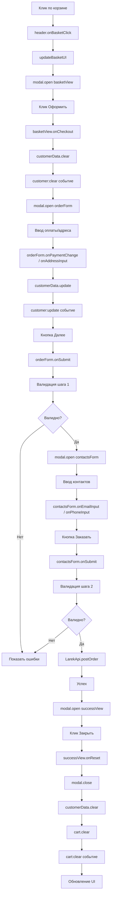
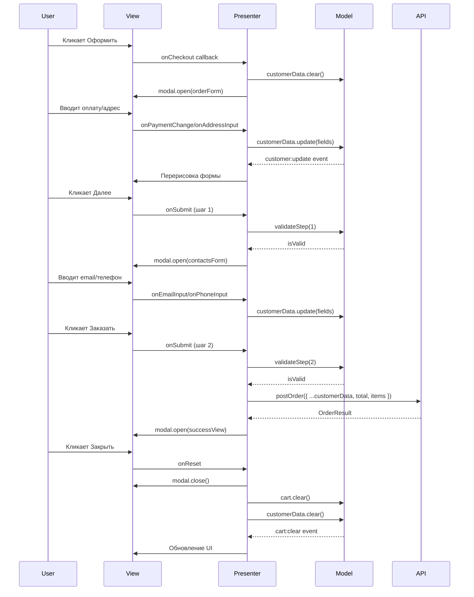

# Проектная работа "Веб-ларек"

Стек: HTML, SCSS, TS, Vite

Структура проекта:

- src/ — исходные файлы проекта
- src/components/ — папка с JS компонентами
- src/components/base/ — папка с базовым кодом

Важные файлы:

- index.html — HTML-файл главной страницы
- src/types/index.ts — файл с типами
- src/main.ts — точка входа приложения
- src/scss/styles.scss — корневой файл стилей
- src/utils/constants.ts — файл с константами
- src/utils/utils.ts — файл с утилитами

## Установка и запуск

Для установки и запуска проекта необходимо выполнить команды

```
npm install
npm run dev
```

или

```
yarn
yarn dev
```

## Сборка

```
npm run build
```

или

```
yarn build
```

# Интернет-магазин «Web-Larёk»

«Web-Larёk» — это интернет-магазин с товарами для веб-разработчиков, где пользователи могут просматривать товары, добавлять их в корзину и оформлять заказы. Сайт предоставляет удобный интерфейс с модальными окнами для просмотра деталей товаров, управления корзиной и выбора способа оплаты, обеспечивая полный цикл покупки с отправкой заказов на сервер.

## Архитектура приложения

Код приложения разделен на слои согласно парадигме MVP (Model-View-Presenter), которая обеспечивает четкое разделение ответственности между классами слоев Model и View. Каждый слой несет свой смысл и ответственность:

Model - слой данных, отвечает за хранение и изменение данных.  
View - слой представления, отвечает за отображение данных на странице.  
Presenter - презентер содержит основную логику приложения и отвечает за связь представления и данных.

Взаимодействие между классами обеспечивается использованием событийно-ориентированного подхода. Модели и Представления генерируют события при изменении данных или взаимодействии пользователя с приложением, а Презентер обрабатывает эти события используя методы как Моделей, так и Представлений.

### Базовый код

#### Класс Component

Является базовым классом для всех компонентов интерфейса.
Класс является дженериком и принимает в переменной `T` тип данных, которые могут быть переданы в метод `render` для отображения.

Конструктор:  
`constructor(container: HTMLElement)` - принимает ссылку на DOM элемент за отображение, которого он отвечает.

Поля класса:  
`container: HTMLElement` - поле для хранения корневого DOM элемента компонента.

Методы класса:  
`render(data?: Partial<T>): HTMLElement` - Главный метод класса. Он принимает данные, которые необходимо отобразить в интерфейсе, записывает эти данные в поля класса и возвращает ссылку на DOM-элемент. Предполагается, что в классах, которые будут наследоваться от `Component` будут реализованы сеттеры для полей с данными, которые будут вызываться в момент вызова `render` и записывать данные в необходимые DOM элементы.  
`setImage(element: HTMLImageElement, src: string, alt?: string): void` - утилитарный метод для модификации DOM-элементов ``

#### Класс Api

Содержит в себе базовую логику отправки запросов.

Конструктор:  
`constructor(baseUrl: string, options: RequestInit = {})` - В конструктор передается базовый адрес сервера и опциональный объект с заголовками запросов.

Поля класса:  
`baseUrl: string` - базовый адрес сервера  
`options: RequestInit` - объект с заголовками, которые будут использованы для запросов.

Методы:  
`get(uri: string): Promise<object>` - выполняет GET запрос на переданный в параметрах ендпоинт и возвращает промис с объектом, которым ответил сервер  
`post(uri: string, data: object, method: ApiPostMethods = 'POST'): Promise<object>` - принимает объект с данными, которые будут переданы в JSON в теле запроса, и отправляет эти данные на ендпоинт переданный как параметр при вызове метода. По умолчанию выполняется `POST` запрос, но метод запроса может быть переопределен заданием третьего параметра при вызове.  
`handleResponse(response: Response): Promise<object>` - защищенный метод проверяющий ответ сервера на корректность и возвращающий объект с данными полученный от сервера или отклоненный промис, в случае некорректных данных.

#### Класс EventEmitter

Брокер событий реализует паттерн "Наблюдатель", позволяющий отправлять события и подписываться на события, происходящие в системе. Класс используется для связи слоя данных и представления.

Конструктор класса не принимает параметров.

Поля класса:  
`_events: Map<string | RegExp, Set<Function>>)` - хранит коллекцию подписок на события. Ключи коллекции - названия событий или регулярное выражение, значения - коллекция функций обработчиков, которые будут вызваны при срабатывании события.

Методы класса:  
`on<T extends object>(event: EventName, callback: (data: T) => void): void` - подписка на событие, принимает название события и функцию обработчик.  
`emit<T extends object>(event: string, data?: T): void` - инициализация события. При вызове события в метод передается название события и объект с данными, который будет использован как аргумент для вызова обработчика.  
`trigger<T extends object>(event: string, context?: Partial<T>): (data: T) => void` - возвращает функцию, при вызове которой инициализируется требуемое в параметрах событие с передачей в него данных из второго параметра.

#### Типы данных

Все типы объявлены в файле `src/types/index.ts`.

**`ApiPostMethods`** — тип, описывающий доступные HTTP-методы для POST-запросов:

```typescript
export type ApiPostMethods = "POST" | "PUT" | "DELETE";
```

**`IApi`** — интерфейс для класса отправки HTTP-запросов. Используется для инверсии зависимостей:

```typescript
export interface IApi {
  get<T extends object>(uri: string): Promise<T>;
  post<T extends object>(
    uri: string,
    data: object,
    method?: ApiPostMethods,
  ): Promise<T>;
}
```

**`Product`** — интерфейс товара:

```typescript
export interface Product {
  id: string;
  title: string;
  image: string;
  category: string;
  price: number | null;
  description: string;
}
```

**`Customer`** — интерфейс данных покупателя:

```typescript
export interface Customer {
  payment: "card" | "cash" | "";
  address: string;
  email: string;
  phone: string;
}
```

**`CustomerValidationResult`** — результат валидации данных покупателя:

```typescript
export interface CustomerValidationResult {
  isValid: boolean;
  errors: Partial<Record<keyof Customer, string>>;
}
```

**`ProductListResponse`** — ответ сервера со списком товаров:

```typescript
export interface ProductListResponse {
  total: number;
  items: Product[];
}
```

**`Order`** — данные для отправки заказа на сервер. Расширяет `Customer` полями `total` и `items`:

```typescript
export interface Order extends Customer {
  total: number;
  items: string[];
}
```

**`OrderResult`** — результат создания заказа на сервере:

```typescript
export interface OrderResult {
  id: string;
  total: number;
}
```

#### Модели данных

##### Catalog

Класс для хранения и управления каталогом товаров.

```typescript
export class Catalog {
  private products: Product[] = [];
  private selectedProduct: Product | null = null;

  /** Сохранение массива товаров */
  public setProducts(products: Product[]): void {
    this.products = [...products];
  }

  /** Получение массива товаров */
  public getProducts(): Product[] {
    return [...this.products];
  }

  /** Получение одного товара по ID */
  public getProductById(id: string): Product | undefined {
    return this.products.find((product) => product.id === id);
  }

  /** Сохранение товара для подробного отображения */
  public setSelectedProduct(product: Product | null): void {
    this.selectedProduct = product;
  }

  /** Получение товара для подробного отображения */
  public getSelectedProduct(): Product | null {
    return this.selectedProduct;
  }
}
```

Поля класса:
`products: Product[]` — массив всех товаров каталога.
`selectedProduct: Product | null` — текущий выбранный товар для подробного отображения.

Методы класса:
`setProducts(products: Product[]): void` — сохраняет массив товаров, создавая копию переданного массива.
`getProducts(): Product[]` — возвращает копию массива всех товаров.
`getProductById(id: string): Product | undefined` — возвращает товар с указанным ID или `undefined`, если товар не найден.
`setSelectedProduct(product: Product | null): void` — сохраняет товар для подробного отображения или сбрасывает выбор при передаче `null`.
`getSelectedProduct(): Product | null` — возвращает текущий выбранный товар или `null`.

##### Cart

Класс для хранения и управления корзиной покупок.

```typescript
export class Cart {
  private items: Product[] = [];

  /** Получение массива товаров в корзине */
  public getItems(): Product[] {
    return [...this.items];
  }

  /** Добавление товара в корзину */
  public addItem(product: Product): void {
    this.items.push(product);
  }

  /** Удаление товара из корзины */
  public removeItem(product: Product): void {
    const index = this.items.findIndex((item) => item.id === product.id);
    if (index !== -1) {
      this.items.splice(index, 1);
    }
  }

  /** Очистка корзины */
  public clear(): void {
    this.items = [];
  }

  /** Получение стоимости всех товаров в корзине */
  public getTotalPrice(): number {
    return this.items.reduce((sum, item) => sum + (item.price ?? 0), 0);
  }

  /** Получение количества товаров в корзине */
  public getItemCount(): number {
    return this.items.length;
  }

  /** Проверка наличия товара в корзине по ID */
  public hasItem(id: string): boolean {
    return this.items.some((item) => item.id === id);
  }
}
```

Поля класса:
`items: Product[]` — массив товаров, добавленных в корзину.

Методы класса:
`getItems(): Product[]` — возвращает копию массива товаров в корзине.
`addItem(product: Product): void` — добавляет товар в корзину.
`removeItem(product: Product): void` — удаляет товар из корзины по совпадению ID.
`clear(): void` — очищает корзину.
`getTotalPrice(): number` — возвращает суммарную стоимость всех товаров в корзине (товары с `null` ценой считаются как 0).
`getItemCount(): number` — возвращает количество товаров в корзине.
`hasItem(id: string): boolean` — проверяет наличие товара с указанным ID в корзине.

##### CustomerData

Класс для хранения и валидации данных покупателя.

```typescript
export class CustomerData {
  private data: Customer = {
    payment: "",
    address: "",
    email: "",
    phone: "",
  };

  /** Сохранение данных в модели */
  public update(fields: Partial<Customer>): void {
    this.data = { ...this.data, ...fields };
  }

  /** Получение всех данных покупателя */
  public getData(): Customer {
    return { ...this.data };
  }

  /** Очистка данных покупателя */
  public clear(): void {
    this.data = { payment: "", address: "", email: "", phone: "" };
  }

  /** Валидация данных */
  public validate(): CustomerValidationResult {
    const errors: Partial<Record<keyof Customer, string>> = {};

    if (!this.data.payment) {
      errors.payment = "Необходимо выбрать способ оплаты";
    }
    if (!this.data.address.trim()) {
      errors.address = "Адрес не может быть пустым";
    }
    if (!this.data.email.trim()) {
      errors.email = "Email не может быть пустым";
    }
    if (!this.data.phone.trim()) {
      errors.phone = "Телефон не может быть пустым";
    }

    return {
      isValid: Object.keys(errors).length === 0,
      errors,
    };
  }
}
```

Поля класса:
`data: Customer` — объект с данными покупателя (способ оплаты, адрес, email, телефон).

Методы класса:
`update(fields: Partial<Customer>): void` — обновляет переданные поля данных покупателя, не перезаписывая остальные.
`getData(): Customer` — возвращает копию объекта с данными покупателя.
`clear(): void` — сбрасывает все данные покупателя к пустым значениям.
`validate(): CustomerValidationResult` — проверяет все поля на заполненность и возвращает объект `{ isValid: boolean, errors: Partial<Record<keyof Customer, string>> }`.

#### Слой коммуникации

Класс для взаимодействия с сервером API. Использует композицию — принимает в конструктор объект, реализующий интерфейс `IApi`, и делегирует ему выполнение HTTP-запросов.

```typescript
export class LarekApi {
  private _api: IApi;

  /**
   * @param api — объект, реализующий интерфейс IApi
   */
  constructor(api: IApi) {
    this._api = api;
  }

  /** Получение списка всех товаров */
  getProducts(): Promise<Product[]> {
    return this._api
      .get<ProductListResponse>("/product")
      .then((data) => data.items);
  }

  /** Получение одного товара по ID */
  getProductById(id: string): Promise<Product> {
    return this._api.get<Product>(`/product/${id}`);
  }

  /** Отправка заказа на сервер */
  postOrder(order: Order): Promise<OrderResult> {
    return this._api.post<OrderResult>("/order", order);
  }
}
```

Поля класса:
`_api: IApi` — объект, реализующий интерфейс `IApi`, через который выполняются запросы.

Методы класса:
`getProducts(): Promise<Product[]>` — выполняет GET-запрос к ендпоинту `/product`, получает объект с массивом товаров и возвращает сам массив.
`getProductById(id: string): Promise<Product>` — выполняет GET-запрос к ендпоинту `/product/{id}` и возвращает объект одного товара.
`postOrder(order: Order): Promise<OrderResult>` — выполняет POST-запрос к ендпоинту `/order`, передавая данные заказа, и возвращает результат создания заказа.

## Слой представления

View-слой **не генерирует события**. Используется паттерн **Callback Injection**: Презентер передаёт функции-обработчики через сеттеры вида `onAction`. Это делает компоненты полностью изолированными от бизнес-логики.

| Класс              | Назначение               | Ключевые сеттеры / колбэки                                                                        |
| :----------------- | :----------------------- | :------------------------------------------------------------------------------------------------ |
| **Базовые классы** |                          |                                                                                                   |
| `BaseCardView`     | Базовый класс карточек   | `title`, `price`, `category`, `image`                                                             |
| `BaseFormView`     | Базовый класс форм       | `errors`, `valid`, `onSubmit`, методы `getFormValues()`, `reset()`                                |
| **Карточки**       |                          |                                                                                                   |
| `GalleryView`      | Сетка товаров            | `items: HTMLElement[]`                                                                            |
| `CatalogCardView`  | Карточка в каталоге      | `id`, `title`, `category`, `image`, `price`, `onSelect`                                           |
| `PreviewCardView`  | Детальный просмотр       | `title`, `category`, `image`, `description`, `price`, `inCart`, `onAddToCart`, `onRemoveFromCart` |
| `BasketCardView`   | Позиция в корзине        | `index`, `title`, `price`, `id`, `onDelete`                                                       |
| **Формы**          |                          |                                                                                                   |
| `OrderFormView`    | Шаг 1: Оплата + Адрес    | `payment`, `address`, `errors`, `valid`, `onPaymentChange`, `onAddressInput`, `onSubmit`          |
| `ContactsFormView` | Шаг 2: Email + Телефон   | `email`, `phone`, `errors`, `valid`, `onEmailInput`, `onPhoneInput`, `onSubmit`                   |
| **Прочие**         |                          |                                                                                                   |
| `BasketView`       | Контейнер корзины        | `items`, `total`, `canCheckout`, `onCheckout`                                                     |
| `OrderSuccessView` | Экран успеха             | `total`, `onReset`                                                                                |
| `ModalView`        | Модальное окно + оверлей | `content`, методы `open(component)`, `close()`                                                    |
| `HeaderView`       | Шапка + счётчик          | `counter`, `onBasketClick`                                                                        |

---

## 🎛 Презентер (`src/main.ts`)

Файл выступает **Composition Root** и центральным маршрутизатором.

### 🔹 Маршрутизация пользовательских действий

| Действие                | Обработчик                                     | Результат                                             |
| :---------------------- | :--------------------------------------------- | :---------------------------------------------------- |
| Клик по корзине         | `header.onBasketClick`                         | `updateBasketUI()` → `modal.open(basketView)`         |
| Клик "Оформить"         | `basketView.onCheckout`                        | `customerData.clear()` → открытие `orderForm`         |
| Ввод оплаты/адреса      | `orderForm.onPaymentChange` / `onAddressInput` | `customerData.update()` → перерисовка валидации       |
| Submit формы адреса     | `orderForm.onSubmit`                           | Валидация → переход к `contactsForm` или показ ошибок |
| Ввод контактов / Submit | `contactsForm.on...` / `onSubmit`              | Валидация → `LarekApi.postOrder()`                    |
| Успешный заказ          | `.then(res)`                                   | Рендер `successView` → `modal.open(successView)`      |
| Сброс после успеха      | `successView.onReset`                          | `modal.close()` → очистка моделей и UI                |

### 🔹 Подписка на события моделей

| Событие                                   | Действие Презентера                                                                        |
| :---------------------------------------- | :----------------------------------------------------------------------------------------- |
| `catalog:update`                          | Генерирует массив `CatalogCardView`, навешивает `onSelect`, рендерит `galleryView`         |
| `catalog:selected-change`                 | Рендерит `PreviewCardView`, проверяет наличие в корзине, открывает модалку                 |
| `cart:add` / `cart:remove` / `cart:clear` | Обновляет счётчик, вызывает `updateBasketUI()`, синхронизирует состояние `PreviewCardView` |
| `customer:update`                         | Синхронизирует данные в `orderForm` и `contactsForm`                                       |

---

## 📡 Система событий

В приложении используется **гибридный подход**:

- **Модели** генерируют события через `EventEmitter`.
- **Представления** используют прямые колбэки (Callback Injection). Это исключает "сплошную шину событий", упрощает отладку и делает View переиспользуемыми.

### 🔹 События моделей

События генерируются в моделях, наследующих `EventEmitter`. Презентер подписывается на эти события для синхронизации UI.

#### Каталог товаров (`Catalog`)

| Событие                   | Payload                        | Описание                                         | Источник                      |
| :------------------------ | :----------------------------- | :----------------------------------------------- | :---------------------------- |
| `catalog:update`          | `{ products: Product[] }`      | Загружен/обновлён список товаров в каталоге      | `setProducts(products)`       |
| `catalog:selected-change` | `{ product: Product \| null }` | Изменён выбранный товар для детального просмотра | `setSelectedProduct(product)` |

**Пример подписки:**

```typescript
catalog.on<CatalogUpdateEvent>("catalog:update", ({ products }) => {
  // Обновить галерею товаров
  const cards = products.map(
    (p) => new CatalogCardView(template.cloneNode(true)),
  );
  galleryView.items = cards.map((c) => c.render());
});
```

#### Корзина покупок (`Cart`)

| Событие       | Payload                | Описание                  | Источник              |
| :------------ | :--------------------- | :------------------------ | :-------------------- |
| `cart:add`    | `{ product: Product }` | Товар добавлен в корзину  | `addItem(product)`    |
| `cart:remove` | `{ product: Product }` | Товар удалён из корзины   | `removeItem(product)` |
| `cart:clear`  | `{ items: Product[] }` | Корзина полностью очищена | `clear()`             |

**Пример подписки:**

```typescript
cart.on<CartAddEvent>("cart:add", ({ product }) => {
  // Обновить счётчик в шапке
  headerView.counter = cart.getItemCount();
  // Обновить карточку товара в превью
  previewView.inCart = true;
});
```

#### Данные покупателя (`CustomerData`)

| Событие           | Payload              | Описание                                            | Источник         |
| :---------------- | :------------------- | :-------------------------------------------------- | :--------------- |
| `customer:update` | `{ data: Customer }` | Обновлены данные покупателя (оплата/адрес/контакты) | `update(fields)` |
| `customer:clear`  | `{ data: Customer }` | Данные покупателя сброшены к пустым значениям       | `clear()`        |

**Пример подписки:**

```typescript
customerData.on<CustomerUpdateEvent>("customer:update", ({ data }) => {
  // Синхронизировать данные с формами
  orderFormView.payment = data.payment;
  orderFormView.address = data.address;
});
```

### 🔹 Callback-интерфейсы представлений

Представления **не генерируют события**. Вместо этого они вызывают переданные в сеттеры `on*` колбэки.

| Представление      | Callback-интерфейс                                 | Когда вызывается                      |
| :----------------- | :------------------------------------------------- | :------------------------------------ |
| `CatalogCardView`  | `onSelect: () => void`                             | Клик по карточке товара               |
| `PreviewCardView`  | `onAddToCart: () => void`                          | Клик "В корзину"                      |
| `PreviewCardView`  | `onRemoveFromCart: () => void`                     | Клик "Удалить из корзины"             |
| `BasketCardView`   | `onDelete: () => void`                             | Клик "Удалить" у товара в корзине     |
| `BasketView`       | `onCheckout: () => void`                           | Клик "Оформить заказ"                 |
| `OrderFormView`    | `onPaymentChange: (value: "card"\|"cash") => void` | Выбор способа оплаты                  |
| `OrderFormView`    | `onAddressInput: (value: string) => void`          | Ввод адреса                           |
| `OrderFormView`    | `onSubmit: () => void`                             | Отправка формы адреса                 |
| `ContactsFormView` | `onEmailInput: (value: string) => void`            | Ввод email                            |
| `ContactsFormView` | `onPhoneInput: (value: string) => void`            | Ввод телефона                         |
| `ContactsFormView` | `onSubmit: () => void`                             | Отправка формы контактов              |
| `OrderSuccessView` | `onReset: () => void`                              | Клик "Закрыть" после успешного заказа |
| `HeaderView`       | `onBasketClick: () => void`                        | Клик по иконке корзины в шапке        |
| `ModalView`        | (внутренние)                                       | Закрыть модалку по крестику/клику     |

### 🔹 Поток событий при оформлении заказа



---

## 🎛 Презентер (`src/main.ts`)

Презентер — это **Composition Root** приложения. Содержит всю бизнес-логику и отвечает за связь моделей и представлений. Код презентера размещён в основном скрипте `main.ts` без выноса в отдельный класс.

### 🔹 Принципы работы

1. **Не генерирует события** — только обрабатывает события от моделей и представлений.
2. **Callback Injection** — передаёт обработчики в представления через сеттеры `on*`.
3. **Централизованная логика** — вся навигация и взаимодействие сосредоточены в одном месте.

### 🔹 Обработчики событий моделей

| Событие модели            | Обработчик                                   | Действия презентера                                                                                                                                                                                                                                     |
| :------------------------ | :------------------------------------------- | :------------------------------------------------------------------------------------------------------------------------------------------------------------------------------------------------------------------------------------------------------ |
| `catalog:update`          | `catalog.on('catalog:update', ...)`          | 1. Получает массив товаров через `catalog.getProducts()`<br>2. Создаёт `CatalogCardView` для каждого товара<br>3. Навешивает `onSelect = () => catalog.setSelectedProduct(product)`<br>4. Рендерит галерею через `galleryView.render({ items: [...] })` |
| `catalog:selected-change` | `catalog.on('catalog:selected-change', ...)` | 1. Рендерит `previewCard` с данными товара<br>2. Проверяет наличие в корзине через `cart.hasItem()`<br>3. Навешивает `onAddToCart` или `onRemoveFromCart`<br>4. Открывает модалку с превью через `modal.open(previewCard)`                              |
| `cart:add`                | `cart.on('cart:add', ...)`                   | 1. Обновляет счётчик в шапке `header.counter`<br>2. Перерисовывает корзину `updateBasketUI()`<br>3. Если товар открыт в превью — обновляет состояние кнопки                                                                                             |
| `cart:remove`             | `cart.on('cart:remove', ...)`                | 1. Обновляет счётчик в шапке<br>2. Перерисовывает корзину<br>3. Если товар открыт в превью — меняет кнопку на "В корзину"                                                                                                                               |
| `cart:clear`              | `cart.on('cart:clear', ...)`                 | 1. Сбрасывает счётчик в 0<br>2. Перерисовывает корзину<br>3. Сбрасывает состояние кнопки в превью                                                                                                                                                       |
| `customer:update`         | `customerData.on('customer:update', ...)`    | Синхронизирует данные в формах `orderForm` и `contactsForm`                                                                                                                                                                                             |

### 🔹 Обработчики событий представлений (Callback Injection)

| Представление      | Callback           | Действия презентера                                                                                                                                           |
| :----------------- | :----------------- | :------------------------------------------------------------------------------------------------------------------------------------------------------------ |
| `HeaderView`       | `onBasketClick`    | 1. Вызывает `updateBasketUI()`<br>2. Открывает корзину `modal.open(basketView)`                                                                               |
| `BasketView`       | `onCheckout`       | 1. Очищает данные покупателя `customerData.clear()`<br>2. Открывает форму заказа `modal.open(orderForm)`                                                      |
| `OrderFormView`    | `onPaymentChange`  | Обновляет модель `customerData.update({ payment })` и перерисовывает форму                                                                                    |
| `OrderFormView`    | `onAddressInput`   | Обновляет модель `customerData.update({ address })` и перерисовывает форму                                                                                    |
| `OrderFormView`    | `onSubmit`         | 1. Валидирует шаг 1 через `customerData.validateStep(1)`<br>2. При успехе открывает форму контактов<br>3. При ошибке показывает сообщения об ошибках          |
| `ContactsFormView` | `onEmailInput`     | Обновляет модель `customerData.update({ email })` и перерисовывает форму                                                                                      |
| `ContactsFormView` | `onPhoneInput`     | Обновляет модель `customerData.update({ phone })` и перерисовывает форму                                                                                      |
| `ContactsFormView` | `onSubmit`         | 1. Валидирует шаг 2 через `customerData.validateStep(2)`<br>2. При успехе отправляет заказ через `LarekApi.postOrder()`<br>3. При ошибке показывает сообщения |
| `OrderSuccessView` | `onReset`          | 1. Закрывает модалку `modal.close()`<br>2. Очищает корзину `cart.clear()`<br>3. Очищает данные покупателя `customerData.clear()`                              |
| `CatalogCardView`  | `onSelect`         | Вызывает `catalog.setSelectedProduct(product)`                                                                                                                |
| `PreviewCardView`  | `onAddToCart`      | Вызывает `cart.addItem(product)`                                                                                                                              |
| `PreviewCardView`  | `onRemoveFromCart` | Вызывает `cart.removeItem(product)`                                                                                                                           |
| `BasketCardView`   | `onDelete`         | Вызывает `cart.removeItem(product)`                                                                                                                           |

### 🔹 Инициализация приложения

```typescript
// 1. Создание моделей
const catalog = new Catalog();
const cart = new Cart();
const customerData = new CustomerData();

// 2. Создание представлений (с клонированием шаблонов)
const galleryView = new GalleryView(galleryEl);
const modal = new ModalView(modalContainer);
const headerView = new HeaderView(headerEl);
const previewCard = new PreviewCardView(
  previewTemplate.content.cloneNode(true),
);
const basketView = new BasketView(basketTemplate.content.cloneNode(true));
// ... и другие

// 3. Подписка на события моделей
catalog.on("catalog:update", handler);
cart.on("cart:add", handler);
// ...

// 4. Привязка callback-ов к представлениям
headerView.onBasketClick = handler;
previewCard.onAddToCart = handler;
// ...

// 5. Начальная загрузка данных
larekApi.getProducts().then((products) => {
  catalog.setProducts(products); // Запускает событие catalog:update
});
```

### 🔹 Логика оформления заказа



### 🔹 Ключевые методы презентера

| Метод                   | Описание                                                                                                      |
| :---------------------- | :------------------------------------------------------------------------------------------------------------ |
| `updateBasketUI()`      | Пересоздаёт все `BasketCardView` на основе данных из корзины, обновляет счётчик и состояние кнопки "Оформить" |
| `header.counter = N`    | Устанавливает значение счётчика товаров в шапке                                                               |
| `modal.open(component)` | Открывает модальное окно с переданным компонентом                                                             |
| `modal.close()`         | Закрывает модальное окно                                                                                      |

### 🔹 Зависимости

Презентер использует:

- **Модели:** `Catalog`, `Cart`, `CustomerData`, `LarekApi`
- **Представления:** Все View-компоненты (GalleryView, ModalView, HeaderView, PreviewCardView, BasketView, OrderFormView, ContactsFormView, OrderSuccessView, CatalogCardView, BasketCardView)
- **API:** `Api` для HTTP-запросов
- **Константы:** `API_URL` для настройки бэкенда

## 💡 Ключевые архитектурные решения

1. **Callback Injection вместо событий в View** — UI-компоненты не знают о доменной логике. Презентер сам решает, какой метод модели вызвать при клике.
2. **Декларативный рендеринг** — `Component.render(data)` использует `Object.assign`, автоматически вызывая сеттеры. Код презентера остаётся чистым: `view.render({ title, price, valid })`.
3. **Пошаговая валидация** — `CustomerData.validateStep(1|2)` позволяет проверять только текущие поля формы, не блокируя переход между шагами.
4. **Dependency Injection для API** — `LarekApi` принимает интерфейс `IApi`, что позволяет легко подменять транспорт в тестах или при изменении backend.
5. **Централизованный Composition Root** — вся инициализация, привязка событий и логика навигации вынесена в `main.ts`, что упрощает рефакторинг и тестирование.
